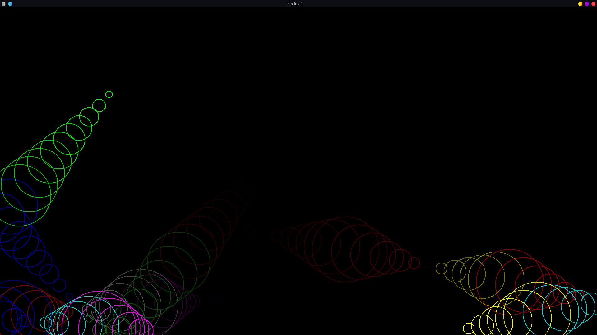
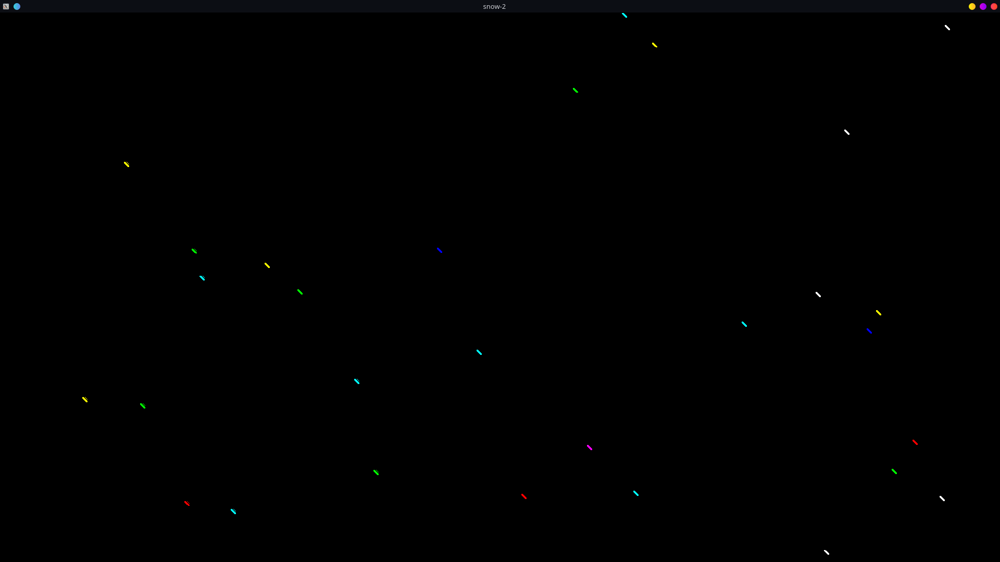
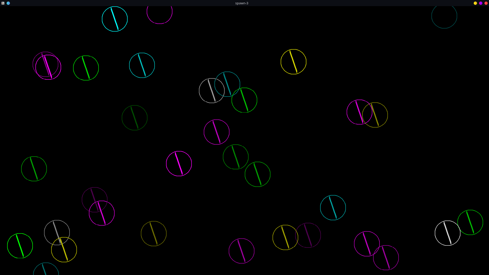
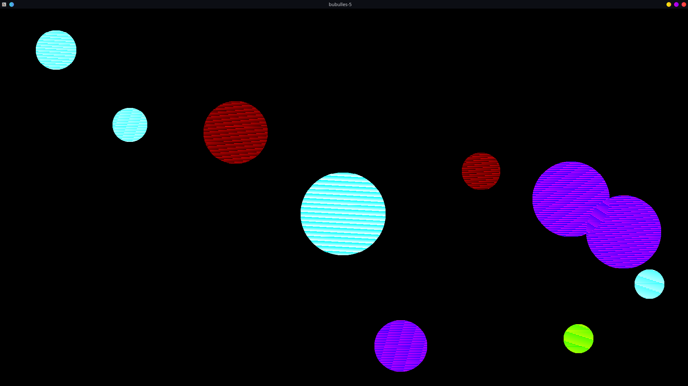
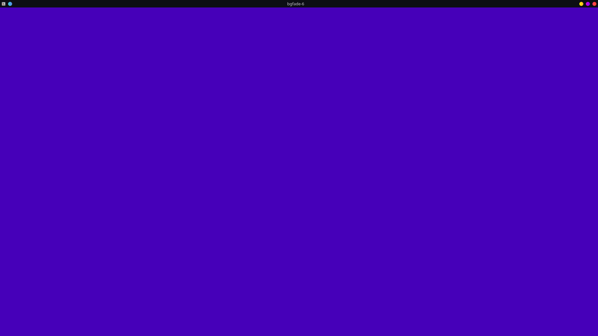
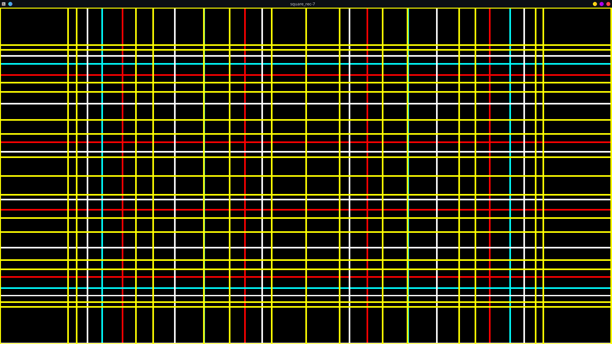
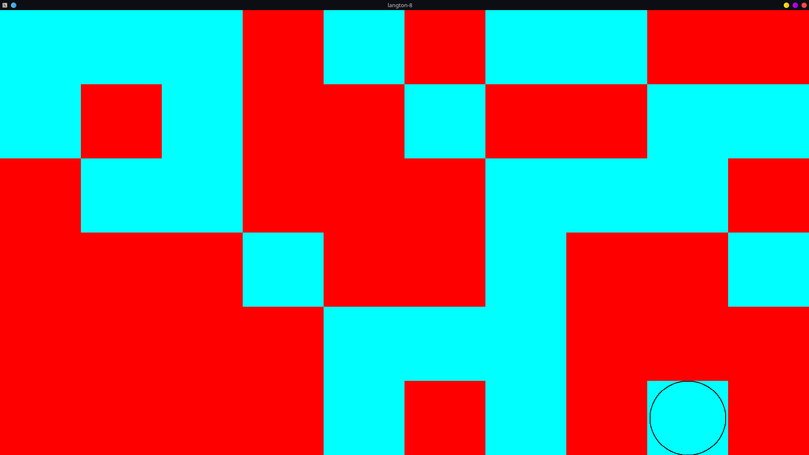
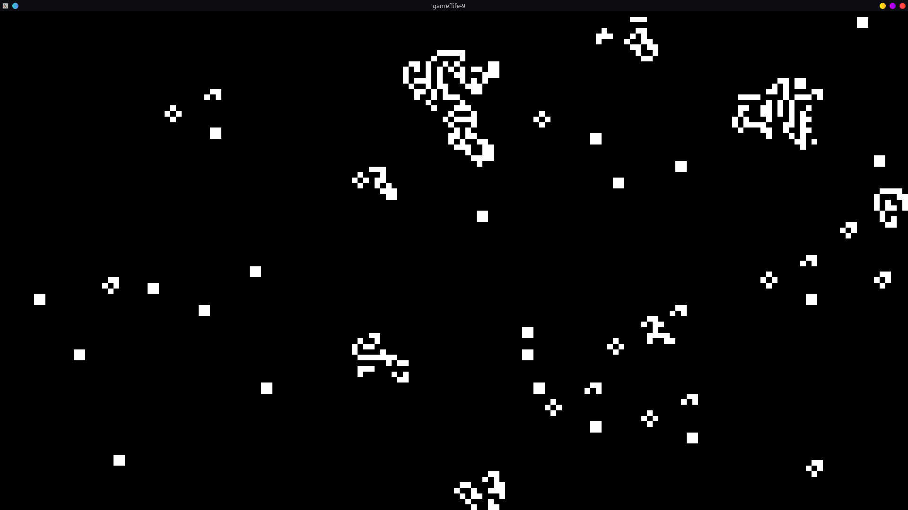
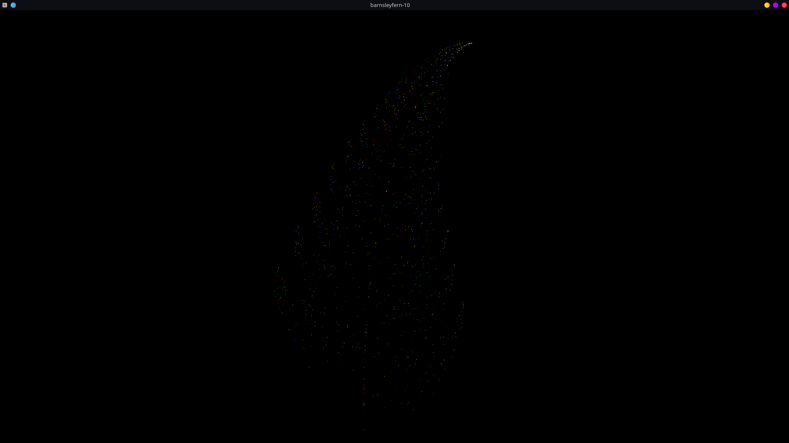
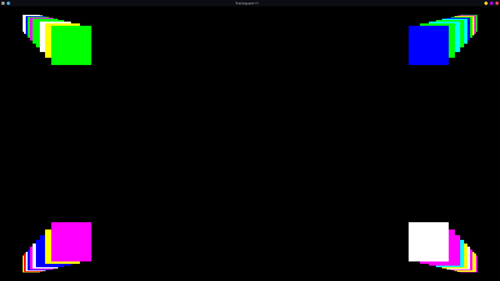

# MYSCREENSAVER

## 11 screensaver

- 1
three circles that bounce and leave a trail behind them

- 2
random little lines fall from top to bottom

- 3
draws randomly crossed circles

- 4
do you remember the 'dvd' image that bounces on the screen ? the same one but with a .bmp image.
the challenge was to retrieve pixels from a .bmp with only possibility to read the file as a "text" file

- 5
windows like bubulles bounce

- 6
a simple background color that fade

- 7
divize the screen into multiple square at each time

- 8
the langton ant, an ant tha moove right or left depends on the situation

- 9
a conway game of life screen

- 10
the barnsley fern 'fractal'

- 11
a square that repeat itself on its border

## Config:

- change the background color [all screens]

go to include/myscreensaver.h

change `sfBlack` to your color (defaults : sfMagenta, sfBlue, sfRed, sfWhite,
sfBlue, sfYellow) : `#define BG_COLOR sfBlack`

if you want to make a custom color : `https://rgb.to/`

- change the image to display [screen 4]

convert your file in bmp (
https://online-converting.com/image/convert2bmp/#
 dont forgot to change the color setting by `32 (True color RGBA)` and let the
`with rows direction` by default.)

go to the include/nico.h and change `"assets/nico.bmp"` by your picture (
`#define IMAGE_DVD "your_path_picture.bmp"`)

- change the size one cell of the langton screen [screen 8]

go to include/langton.h

change the value of macro NUMBER_COL_CASE and NUMBER_LINE_CASE

- change the color of the cells of the langton screen [screen 8]

go to include/langton.h

change the value of macro COLOR_TABLE_1 and COLOR_TABLE_2

- change the size of one cell of the game of life screen [screen 9]

go to include/gameoflife.h

change the value of macro NUMBER_COL_CASE and NUMBER_LINE_CASE

- change the color of the cells of the game of life screen [screen 9]

go to include/gameoflife.h

change the value of macro DEFT_COLOR_1 and DEFT_COLOR_2

## Compil:

`make`
or
`make re`
to re make the executable

if there is some compilation error and you dont modify anything, fill an
issue, else, you have modifed a part that do this error.

if you modified a macro (to change the default behavious) make sur you changed
them to same type (`10` is not the same as `"10"`). If you have any question
feeel free to discuss it on github discussion.

## Run:

`./my_screensaver -h` to get the usage message
